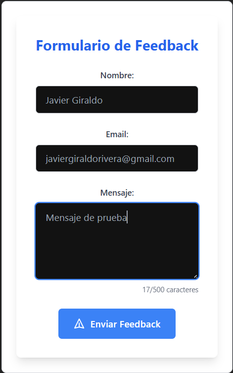

# Reto 5: Formulario de Feedback Avanzado con Validación en Tiempo Real y SweetAlert2

## Descripción

Un formulario de feedback interactivo que permite a los usuarios ingresar su nombre, email y mensaje. Implementa validación en tiempo real para asegurar que los campos requeridos se completen correctamente y que el formato del email sea válido. Al enviar el formulario exitosamente, se muestra una notificación de éxito utilizando SweetAlert2.

## Objetivo

Demostración del uso avanzado de `useState` para la gestión del estado de múltiples campos del formulario y los mensajes de error de validación. Se implementa validación en tiempo real (`onChange` en los inputs) para mejorar la experiencia del usuario. Además, se utiliza SweetAlert2 para proporcionar feedback visual inmediato sobre el estado del envío del formulario. Se aplican estilos con Tailwind CSS para una interfaz de usuario profesional y fácil de usar.

## Funcionalidades

* **Campos de entrada:** Nombre, Email y Mensaje.
* **Validación en tiempo real:** Muestra mensajes de error al interactuar con los campos si la entrada no es válida.
* **Validación de email:** Asegura que el formato del email ingresado sea correcto.
* **Mensajes de error claros:** Indica específicamente qué campos son requeridos o inválidos.
* **Feedback de envío exitoso:** Utiliza SweetAlert2 para mostrar una notificación de éxito al enviar el formulario (simulado).
* **Limpieza del formulario:** Borra los campos después de un envío exitoso.
* **Interfaz intuitiva:** Diseño claro y fácil de entender gracias a Tailwind CSS.

## Tecnologías Utilizadas

* React
* Tailwind CSS
* SweetAlert2

## Cómo Ejecutar localmente

Para probar este reto:

1.  Clona el repositorio.
2.  Navega a la carpeta del reto (`reto-formulario`).
3.  Ejecuta `npm install`.
4.  Ejecuta `npm run dev`.

## Captura de Pantalla

Puedes ver una imagen del reto en funcionamiento en la siguiente ruta:

```markdown
